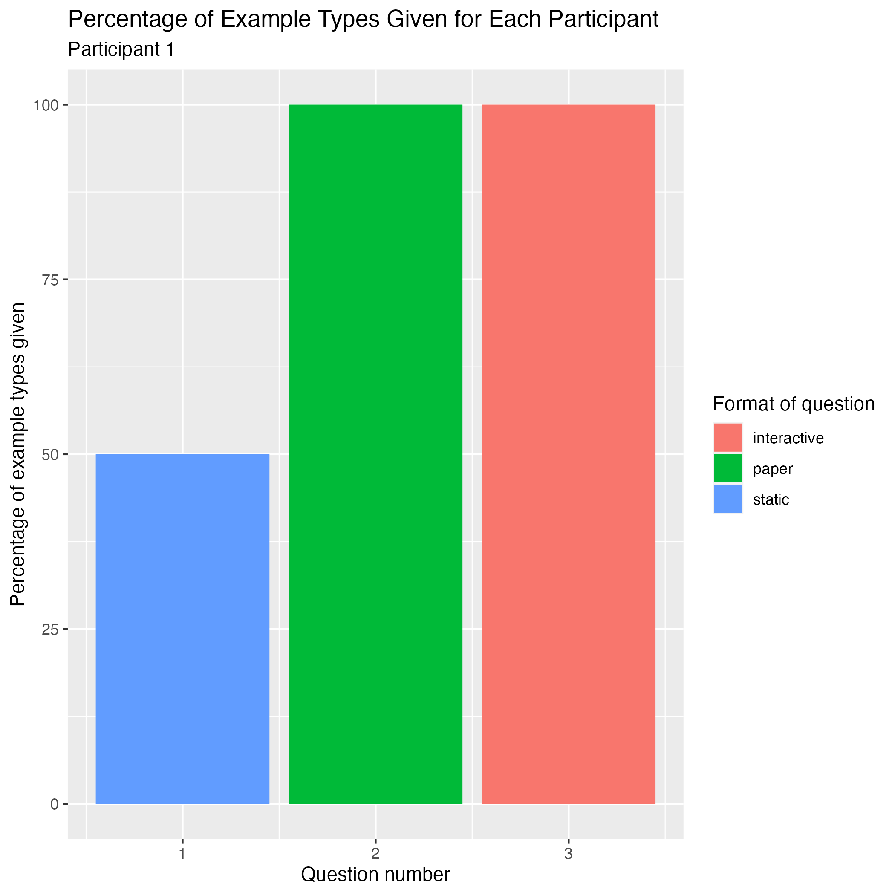

# UG971_Example_Generation_and_STACK
This repository contains supplementary materials for the project UG971 Example generation and STACK by Álvaro Beattie Eizaguirre, Molly Berrick, Eilidh Millin, and Abbie Whitehouse.

Graphs of percentage of total example types each participant gave for each question.
---------------------

